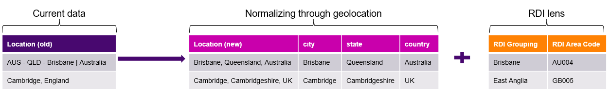

## Fixing Messy Locations: A Data-Driven Approach to Standardizing Job Posting Locations

### 📌 Project Overview
- This project details an **end-to-end geolocation pipeline** to convert **clean, normalise, and enrich location data*** extracted from our datalake of scraped online job descriptions
- Using the **LocationIQ API**, the pipeline extracts key location elements e.g. zip code, city, and state, from unstructured job description data
- The enriched locations enable **location-based analytics that supports detailed regional reporting**

To achieve this, the pipeline follows **three steps**:
1. **Data Cleaning** -> Raw location strings are refined by removing extraneous words (e.g., "remote", "offsite", "work from home") that could mislead the API. In cases of multiple locations in a single entry, the data is split and processed separately
2. **Geolocation Extraction** -> A custom function queries the LocationIQ API with free-form location text, extracting vital geolocation elements while employing back-off strategies to manage API rate limiting
3. **Mapping locations** -> Once the location data is enriched, it is mapped to a self-created set of location groupings (called "RDI Lens") based on country-specific grouping rules, ensuring consistency and accuracy across analyses

**Illustrative Output:**

 

### 🎯 KPIs (Key Performance Indicators)
✅ **Geolocation Accuracy** - Ensure that the LocationIQ API accurately extracts key location elements (city, state, country) from the raw data  
✅ **Processing Throughput** - Monitor and optimise batch processing times to ensure the pipeline can efficiently handle large datasets  
✅ **Minimise Failure Rate** – Keep the proportion of records that cannot be accurately geolocated below 5%  
 

### 📘 Project notebooks
- 📄 **[Data Cleaning + Geolocation function processing](/notebooks/.ipynb)**
- 📄 **[Mapping locations](/notebooks/.ipynb)**
 

### 📂 Dataset
**Source:** 15 million job descriptions **scraped from online job boards** over the course of **3 years** and stored in **Databricks Catalog**  
  
 

### 🔑 Key steps
**1️⃣ Data Extraction & Cleaning**  
- **Extract:** Retrieve raw location data from **Databricks data lake using SQL**  
- **Clean:** Focus on **removing words that are likely to confuse the API** e.g. 'remote', 'location', 'work from home'
- **Exception:** For job descriptions that include multiple locations e.g. 'London | Cambridge | Oxford | Birmingham', handle by exploding into seperate records, so each can be geolocated seperately

**2️⃣ Geolocation Function Definition**  
- **API Query:** Use API documentation to construct PULL request with correct parameters to trasnform **free-form location text** into **structured data e.g. state, city, latitude, longitude**
- **Rate Management:** Incorporate back-off strategies to gracefully handle API rate limits and throttling

**3️⃣ Handling Unmatched Location Data**  
- **Location Accuracy:** Establish criteria to distinguish between accurate and inaccurate geolocations
- **Managing Problematic Locations:** Outline a process for evaluating and managing locations that fail to match, developing workaround

**4️⃣ Mapping to RDI Lens**  
- **Read-Across Mapping:** Use read-across tables to allocate each location with RDI Lens
- **Handle Missing Information:** For records that cannot read-across because of missing data, apply proximity-based approach to allocating as a fallback
 

### 🚀 Challenges & Insights 
⚠️ **Different Countries Handle Locations Uniquely**  
Although we are used to how addresses are written in our home countries, the rest of the world varies significantly—for example, the order of city and state, or using zip codes versus postcodes  
**Solution:** Conduct detailed research into each country’s address format and integrate flexible parameters within the API Query process to accommodate these differences

⚠️ **Ensuring Geolocation Accuracy through Iterative Data Pre-processing**  
Free-form location text can be messy, with certain words often leading to poor API accuracy  
**Solution:** Implement multiple rounds of data cleaning to identify and remove or standardise problematic terms such as "remote" or "work from home", which frequently misled the API  

⚠️ **Some Locations Are Too Dirty! What Do We Do?**  
A small proportion of locations remain too vague or inconsistent to be reliably geolocated  
**Solution:** Accept that dropping a minor percentage of data is acceptable when it prevents unnecesary manual intervention, especially if these cases represent only a trivial fraction of the overall dataset (in this case, less then 1%!)
